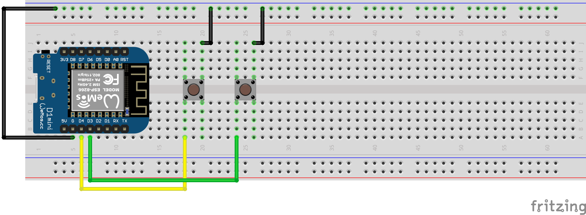
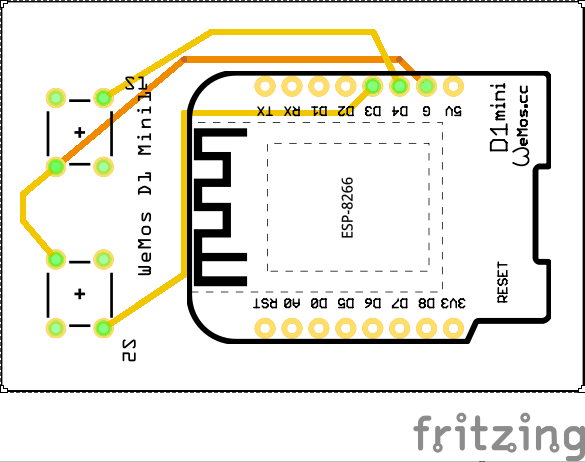
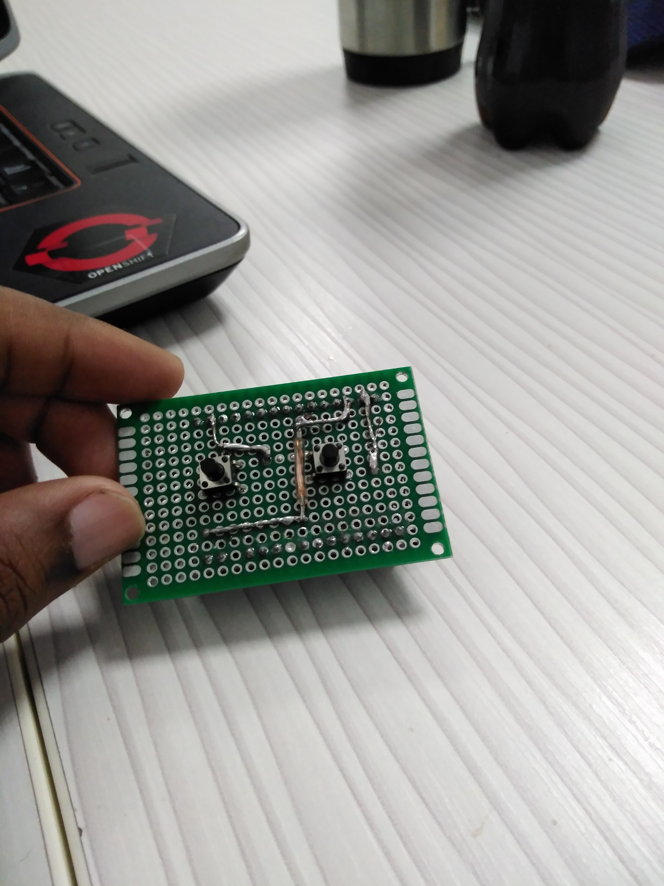
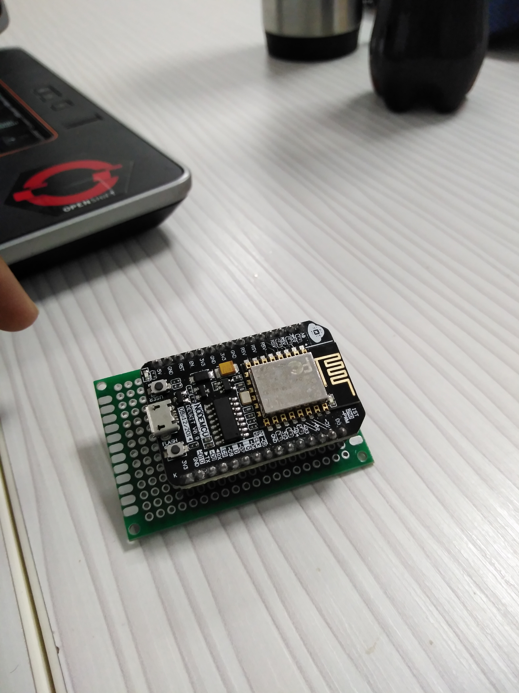

# Yi Shooter

Yi shooter is an esp8266 powered remote control for a Yi Camera.

if you don`t have installed ampy on your computer or micropython on your microcontroller you can download and install it on the links down below.

[Micropython](https://micropython.org/)

[AMPY](https://github.com/pycampers/ampy)

For replicate this proyect there are two topics to do, the Hardware and the Software.


# Hardware

## materials

For the materials you only need this components:

* a breadboard
* two push buttons
* jumper wires
* an esp8266 based board (in my case a nodeMCU v0.9)
* cooper wire
* a perfboard 

## lets put it all together

the conection of the nodeMCU board is extremely easy, you only have to connect the pin 5* and 4* of the esp8266 to the buttons and connect the buttons to ground, like the next image:



\* note:
the pins of the developement board is not the same as the esp8266, consult your developement board documentation to learn more about it.

having tested all the features of the program, we can continue to the pcb.

the pcb connection is the same as the breadboard connection, at the end we going to have something like this:



## final result
as you can see, we have a more minimalistic design as the breadboard version, in real life thats the final result:




\* note:
I use a perfboard and a nodeMCU v0.9 in the MVP because in the software that i use for the schematic doest have the nodeMCU.

# Software

## Set the credentials

The steps to insert the credentials are too simple, you only have to do is find this piece of code:

```python
sta_if = network.WLAN(network.STA_IF)
sta_if.active(True)
sta_if.connect('<your SSID>','<your Password>')
```
the next you have to do is replace the "your ssid" space with your yi camera's wifi name and the "your password" space with your yi camera's password

## instalation
The steps to do the instalation for the software are the next ones:

* Connect the esp8266 to the pc 
    [insert photo]
* open the terminal
* Giving permission to the port, in my case the port /dev/ttyUSB0 
```
    sudo chmod 666 /dev/ttyUSB0
```
* After that we going to go to the esp directory
```
    cd /yi_shooter/esp
```
* Being in the directory ESP you have to type in the terminal the next command to copy the main.py file to the microcontroller
```
    ampy --port /dev/ttyUSB0 put main.py
```
* To test the program you only have to do is type in the terminal the next command
```
    ampy --port /dev/ttyUSB0 run main.py
```
and thats it, you only have to restart the board